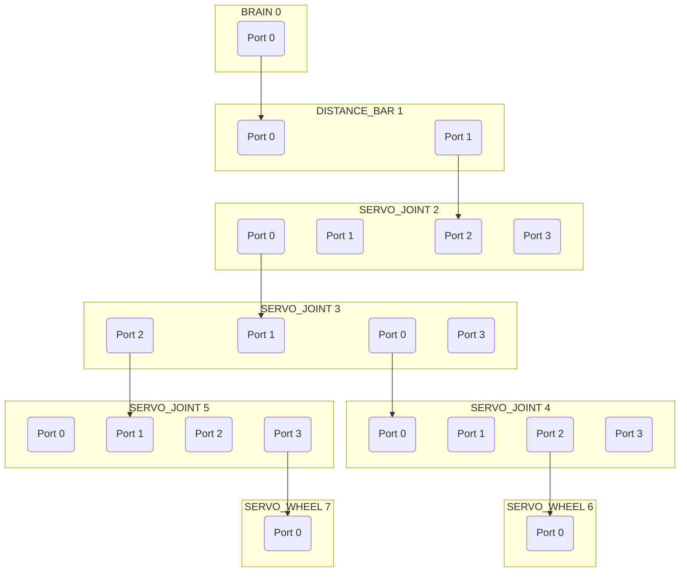

# ClicBot for Python (Unofficial)

[](https://badge.fury.io/py/clicbot-unofficial)

> **Unofficial library — not affiliated with, endorsed by, or associated with KEYi Technology or ClicBot.**
> Protocol inferred from network traffic generated by my own device and the official app, solely for interoperability purposes.

Python library for controlling ClicBot modular robots — motor control, structure discovery, and event-driven programming over TCP/UDP.

## Install

```bash
pip install clicbot-unofficial
```

```python
from clicbot_unofficial import ClicBot, discover_first
```

## Connecting to the robot

The robot communicates over TCP. Your computer and the robot must be on the **same IP network**.

There are two network setups:

### WiFi (recommended)

The robot stores WiFi credentials and reconnects automatically on every boot. **The QR code step is only needed once** when joining a new network for the first time.

**First time — provision the robot onto your WiFi:**

```python
from clicbot_unofficial import build_qr_content, show_qr_code, wait_for_robot

content = build_qr_content("MyWifi", "secret")
show_qr_code(content)        # terminal (default), or mode="file"/"text"
device = wait_for_robot()
```

Hold the QR code in front of the robot's camera. It joins your network, announces its address, and remembers the credentials from then on.

**Already provisioned — just discover it:**

```python
from clicbot_unofficial import discover_first

device = discover_first(timeout=5.0)
```

### Robot hotspot

The robot can also expose its own WiFi access point. Connect your computer to it, then discover the robot via UDP or connect directly to its known IP.

### Connecting

Once you have the device from either method above:

```python
from clicbot_unofficial import ClicBot, BrainState

bot = ClicBot()
bot.connect(device.ip, device.port)
bot.send_client_info()
bot.set_brain_state(BrainState.CUSTOM)

modules = bot.get_structure()  # blocks until the robot replies
for joint in bot.servo_joints:
    joint.rotate_to(90, speed=60)
```

## Authentication

This library connects in **guest mode only**, using the built-in `tourist` username and `userId: 0`. No account or login is required. This is sufficient for all supported robot control operations.

## Discovery

| Function                                             | Description                                                              |
| ---------------------------------------------------- | ------------------------------------------------------------------------ |
| `discover_all(timeout=3.0)`                          | Return all robots found on the local network within the timeout          |
| `discover_first(timeout=5.0)`                        | Return the first robot found, or raise `TimeoutError`                    |
| `discover_via_qrcode(ssid, password, qr_output=...)` | Show a QR code; wait for the robot to join WiFi and announce its address |

## ClicBot API

### Connection

```python
bot.connect(host, port)                     # open TCP connection
bot.send_client_info()                      # handshake (call once after connect)
bot.set_brain_state(BrainState.CUSTOM)      # enable motion commands
bot.disconnect()
```

### Structure

```python
modules = bot.get_structure()        # request tree and block until received
bot.set_structure_watchdog(True)     # continuous change notifications
bot.request_angles()                 # triggers on_angles callback
```

### Motor control

```python
# Servo joints — absolute angle (degrees)
bot.rotate_to(module_id, angle, speed=50)
bot.rotate_to_many([{"module_id": 1, "angle": 90, "speed": 50}])

# Continuous rotation (wheels or joints)
bot.rotate_start(module_id, forward=True, speed=60)
bot.rotate_start_many([{"module_id": 2, "forward": True, "speed": 60}])
bot.rotate_stop()           # stop all rotating modules

# Push-rotate mode
bot.set_push_rotate(module_id, enabled=True)

# Lock / unlock
bot.lock(module_id)
bot.unlock(module_id)
bot.lock_all()
bot.lock_all(locked=False)  # unlock all

# Emergency stop
bot.full_stop(lock=False)
```

### Module accessors

After `get_structure()` the robot tree is available:

```python
bot.root          # BrainModule (id 0)
bot.servo_joints  # List[ServoJointModule]
bot.servo_wheels  # List[ServoWheelModule]
bot.get_module(module_id)
```

Each module exposes the same controls directly:

```python
joint.rotate_to(90, speed=50)
joint.rotate_start(forward=True, speed=60)
joint.rotate_stop()
joint.set_push_rotate(enabled=True)
joint.lock()
joint.unlock()
wheel.rotate_start(forward=False, speed=80)
wheel.rotate_stop()
```

### Callbacks

Assign a function to any of these attributes to receive events:

```python
bot.on_battery          = lambda level: print(f"Battery: {level:.0%}")
bot.on_structure_changed = lambda modules: print(f"{len(modules)} modules")
bot.on_angles           = lambda angles: print(angles)
bot.on_close            = lambda: print("disconnected")
bot.on_error            = lambda exc: print("error:", exc)
```

| Attribute              | Arguments                    | Description          |
| ---------------------- | ---------------------------- | -------------------- |
| `on_close`             | —                            | Connection closed    |
| `on_error`             | `exc`                        | Socket error         |
| `on_battery`           | `level` (0.0–1.0)            | Battery level update |
| `on_structure_changed` | `modules` (dict[id, Module]) | Module tree updated  |
| `on_angles`            | `angles` (dict[id, float])   | Joint angle update   |

## Examples

| File                       | Description                           |
| -------------------------- | ------------------------------------- |
| `examples/01_discovery.py` | Scan the network and list all robots  |
| `examples/02_tree.py`      | Print the module tree                 |
| `examples/03_servo.py`     | Move servo joints to 0° then 90°      |
| `examples/04_rotate.py`    | Spin wheel modules for 2 seconds      |
| `examples/05_qrcode.py`    | Connect a new robot via QR code       |
| `examples/06_mermaid.py`   | Save module tree as a Mermaid diagram |

## Structure visualization

`to_mermaid(structure)` converts the raw module tree into a [Mermaid](https://mermaid.js.org) graph. Each module becomes a labelled subgraph with one node per port; edges show parent–child connections. See `examples/06_mermaid.py` — it saves `structure.md` and reminds you to paste the content into [mermaid.live](https://mermaid.live).

Example output for a simple arm assembly:



## Not supported

The following features are absent from this library and will not be added without significant further reverse-engineering:

- **Official programs** — the built-in robot configurations shipped by KEYi (commands 300, 400, 401, 1034–1037). These require an authenticated account and upload opaque binary assets.
- **Pro actions / face animations** — the "Pro" timeline system sends a ZIP to the brain (cmd 13) that can include servo splines, video, audio, and `SCREEN` keyframe curves that animate the brain's face display. The wire format of the SCREEN block is not fully understood.
- **Brain face display** — the brain's built-in LCD shows animated eye/face expressions. Expressions are controlled via Pro-action SCREEN data or pre-loaded assets uploaded by the official app. There is no standalone "show expression X" command.
- **Steering / locomotion** — the drive mode for wheeled robots (cmds 1012/1013). The wire format is not known.
- **Guide / activate flow** — the factory calibration guide channels (cmd 300). Account-gated and device-specific.
- **Veriface / face asset sync** — the brain sends a ZIP of face-expression images and audio to the app (cmd 14) for preview purposes. Not handled.

## Building and publishing

Build a wheel and source distribution:

```bash
pip install build twine
python -m build
# → dist/clicbot_unofficial-0.1.0-py3-none-any.whl
# → dist/clicbot_unofficial-0.1.0.tar.gz
```

Upload to PyPI:

```bash
twine upload dist/*
```

Install the wheel directly without publishing:

```bash
pip install dist/clicbot_unofficial-0.1.0-py3-none-any.whl
```

Or install in editable mode from the project root for development:

```bash
pip install -e .
```

## Requirements

- Python ≥ 3.10
- `qrcode` — included automatically; needed for `show_qr_code` terminal mode
- `Pillow` — optional, only needed for PNG export (`mode="file"`); install via `pip install "clicbot-unofficial[png]"`

## License

[MIT](LICENSE.md) © 2026 Hannes Rüger

## Legal / Interoperability Notice

This is an independent, unofficial Python library for ClicBot-compatible devices. It is not affiliated with, endorsed by, sponsored by, or associated with KEYi Technology or the ClicBot brand.

The protocol implementation was independently developed by observing network traffic generated by my own device and the official app, solely for the purpose of interoperability. No source code, firmware, binaries, assets, icons, trademarks, private keys, certificates, or other proprietary materials from KEYi Technology are included in this project.

This project is intended to enable lawful control of devices owned by the user. It is not intended to bypass authentication, digital rights management, copy protection, access controls, or any other technical protection measures.

"ClicBot" and related names may be trademarks of their respective owners and are used here only to identify compatibility.
